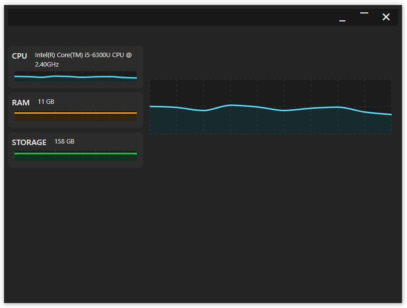

<div align="center">
  <h2>💻 Computer Performance Tracker</h2>
  <p>A cross-platform desktop application built with Electron and React to monitor system resources in real-time.</p>

  <p>
    <a href="#about-the-project"><strong>Explore the project »</strong></a>
    <br />
    <br />
    <a href="#">Report Bug</a>
    ·
    <a href="#">Request Feature</a>
  </p>
</div>

<!-- ABOUT THE PROJECT -->
## About The Project



The **Computer Performance Tracker** is a lightweight, responsive desktop application that provides real-time monitoring of your system's critical resources. Built using modern web technologies packaged into a native desktop experience, it allows users to easily visualize CPU utilization, memory consumption, and other system-level metrics at a glance.

### ✨ Key Features

*   **Real-Time Monitoring:** Track CPU and RAM usage live.
*   **Data Visualization:** Beautiful, dynamic charts powered by Recharts.
*   **Cross-Platform:** Works seamlessly on Windows, macOS, and Linux.
*   **Native Feel:** Clean UI that integrates nicely with the host operating system.
*   **Type-Safe:** Fully developed using TypeScript for robust code quality.

### 🛠️ Built With

*   
*   
*   
*   
*   **Recharts** for intuitive data visualizations.
*   **os-utils** for extracting system hardware metrics.

<!-- GETTING STARTED -->
## Getting Started

To get a local copy up and running, follow these simple steps.

### Prerequisites

*   Node.js (v18 or higher recommended)
*   npm

### Installation & Setup

1.  **Clone the repository**
    ```sh
    git clone https://github.com/Imtiaz-Ali17314/Computer-Performance-Tracker-Electron-Js-Desktop-App.git
    ```
2.  **Navigate to the project directory**
    ```sh
    cd Computer-Performance-Tracker-Electron-Js-Desktop-App
    ```
3.  **Install NPM packages**
    ```sh
    npm install
    ```
4.  **Run the application in development mode**
    ```sh
    npm run dev
    ```
    *This command uses `npm-run-all` to run both the React (Vite) dev server and the Electron app concurrently.*

### Building for Production

You can build the application for your specific operating system using the following commands:

*   **For Windows:**
    ```sh
    npm run dist:win
    ```
*   **For macOS:**
    ```sh
    npm run dist:mac
    ```
*   **For Linux:**
    ```sh
    npm run dist:linux
    ```

<!-- CONTRIBUTING -->
## Contributing

Contributions are what make the open-source community such an amazing place to learn, inspire, and create. Any contributions you make are **greatly appreciated**.

<!-- LICENSE -->
## License

Distributed under the MIT License. See `LICENSE` for more information.

<!-- CONTACT -->
## Contact

Imtiaz Ali - [GitHub Profile](https://github.com/Imtiaz-Ali17314)

Project Link: [https://github.com/Imtiaz-Ali17314/Computer-Performance-Tracker-Electron-Js-Desktop-App](https://github.com/Imtiaz-Ali17314/Computer-Performance-Tracker-Electron-Js-Desktop-App)
